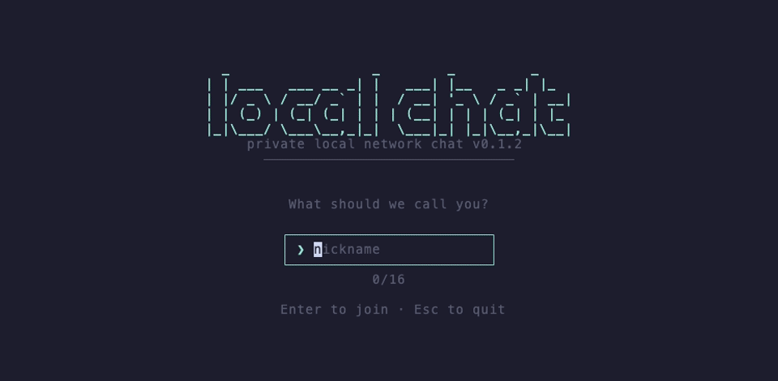
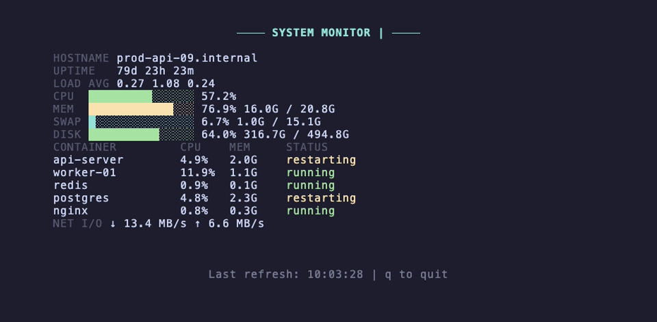
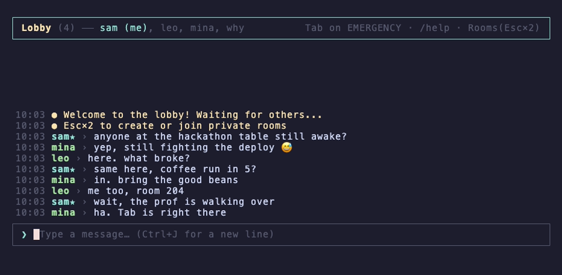

<h1 align="center">local-chat</h1>

<p align="center"><strong>Terminal chat for everyone on the same WiFi. One command, no accounts, no server.</strong></p>

<p align="center">
  <a href="https://www.npmjs.com/package/local-chat"></a>
  <a href="LICENSE"></a>
  <a href="#requirements"></a>
</p>

<p align="center">
  
</p>

```bash
npx local-chat
```

That is it.

Type a nickname and you are in the **lobby**, a chat room shared by everyone running local-chat on the network. Press `Esc` twice to browse **private rooms**, and create or join one. Nothing is installed globally, nothing is written to disk, and messages live in memory only: close the terminal and they are gone.

## Good for

- A dorm floor or a campus lab
- The table you are sitting at during a hackathon
- An office or a coworking space
- A classroom or a workshop: the host opens a room, everyone joins from the terminal they already have open
- Café and conference WiFi
- LAN parties
- Two machines at home that need to talk to each other

Anywhere people share a network and everyone already has a terminal open. The conversation is bounded by the network you are on, and it disappears when you close the terminal.

## Boss mode

> **Press `Tab` and the screen becomes a system monitor.**
>
> The header hint reads `Tab on EMERGENCY`. `/fake` and `/f` do the same thing. Any key brings the chat straight back, with your half-typed message still in the input box.

<p align="center">
  
</p>

Yes, something is usually restarting. It looks busier that way.

## Flow

```
Nickname → Lobby (everyone on the network) → Browse Rooms → Create / Join → Private Room
                                                  ↑                              │
                                                  └──────── Esc ×2 ──────────────┘
```

The lobby needs no setup: everyone running `npx local-chat` on the network is in it. `Esc` twice opens the room browser, where you create a room or join one. Password-protected rooms show a lock icon.

<p align="center">
  
</p>

## Messages

Multi-line input. Paste text and code freely: bracketed paste keeps line breaks, tabs become four spaces, and terminal control sequences are stripped. Long messages are never truncated.

Scrolling is line-based: `Shift+↑` / `Shift+↓` for one line, `PgUp` / `PgDn` for a page. While you are scrolled up, incoming messages keep your place and a "N lines below" indicator appears; sending your own message jumps you back to the bottom.

A message starting with `/` is treated as a command unless it spans several lines. To send a single-line message that starts with `/`, prefix it with `//`.

Lobby messages are limited to 800 bytes, because a lobby message is a single UDP packet (about 260 CJK characters or 800 ASCII characters). The header shows a byte counter from 70% of the limit, and an over-limit message is refused with your draft kept. Private rooms have no byte or line limit.

Your draft survives everything: unknown commands, refused messages and boss mode all leave it intact.

## Shortcuts

| Key | Action |
|-----|--------|
| `Enter` | Send |
| `Shift+Enter`, `Ctrl+Enter` | New line, in terminals that can report it (most modern ones; not macOS Terminal.app) |
| `Option+Enter` / `Alt+Enter` | New line, when the terminal sends Option/Alt as Meta |
| `Ctrl+J`, `\` then `Enter` | New line, in every terminal |
| `↑` / `↓` | Move inside the draft |
| `Ctrl+A` / `Ctrl+E` | Line start / line end |
| `Ctrl+U` | Clear the draft |
| `Shift+↑` / `Shift+↓` | Scroll one line |
| `PgUp` / `PgDn` | Page scroll |
| `Tab` | Boss mode |
| `Esc ×2` | Browse rooms |
| `Ctrl+C` | Exit |

## Commands

| Command | Alias | Description |
|---------|-------|-------------|
| `/help` | | Show the help overlay |
| `/users` | | List online users |
| `/erase` | `/e`, `/clear` | Clear all messages |
| `/copy [N]` | `/c` | Copy the Nth most recent message to the clipboard |
| `/fake` | `/f` | Boss mode |
| `/version` | | Show the current version |
| `/quit` | | Exit |

`/copy` uses whichever of `pbcopy`, `clip`, `wl-copy`, `xclip` or `xsel` your system has. `/ㄹ`, `/ㄷ`, `/ㅊ` work as `/f`, `/e`, `/c`: the same physical keys on a Korean keyboard, so you do not have to switch input mode.

Kaomoji, sent as a message: `/shrug` `/tableflip` `/unflip` `/lenny` `/disapproval` `/sparkles`

## How It Works

```
Room Creator (Host)                    Participants
┌─────────────────────┐               ┌──────────────┐
│ WebSocket Server    │◄──────ws─────►│ WS Client    │
│ (message relay)     │               └──────────────┘
│                     │               ┌──────────────┐
│ UDP Broadcaster     │──broadcast───►│ UDP Listener │
│ (room announce)     │               └──────────────┘
└─────────────────────┘

Lobby (all peers)
┌──────────┐  UDP broadcast  ┌──────────┐
│  Peer A  │◄───────────────►│  Peer B  │
└──────────┘                 └──────────┘
```

- **Lobby**: all users exchange messages via UDP broadcast. Obfuscated, not encrypted: the key is a constant in the source, so anyone running the app can read lobby traffic. Treat it as the open channel it is.
- **Private rooms**: the room creator runs a WebSocket server on their own machine. Messages are encrypted with AES-256-GCM. Password rooms derive keys via PBKDF2; public rooms use a random session key.
- **Discovery**: room info is broadcast via UDP every 3 seconds. The room browser lists what it hears, with 🔒 for password-protected rooms.

Written in TypeScript with [Ink](https://github.com/vadimdemedes/ink) (React for terminals) and [`ws`](https://github.com/websockets/ws).

## Security

Read this before using local-chat for anything you would not say out loud in the room.

- Private-room messages are encrypted with AES-256-GCM (Node.js built-in `crypto`). Password rooms derive the key with PBKDF2; public rooms use a random session key.
- **The lobby is obfuscated, not encrypted.** The key is a constant in the source, so anyone running the app can read lobby traffic.
- **Threat model:** this protects against casual snooping by people on the same WiFi. It does not protect against an active attacker on your network. A public room's session key is handed to every joiner in plaintext over `ws://`, and a password room sends a SHA-256 of the password in plaintext, so a captured join lets an attacker read that room. Use a password room with a strong password for anything sensitive.
- Nothing is written to disk. Messages live in memory only.
- Chat traffic never leaves the LAN. The only outbound request is the startup version check to `registry.npmjs.org`. Disable it with `--no-update-check` or `LOCAL_CHAT_NO_UPDATE_CHECK=1`.

## Input methods (IME)

Korean, Japanese and Chinese input methods work. In the lobby and in private rooms, local-chat keeps the terminal cursor on the input caret so the composition preview appears inside the chat input box. Wide characters and emoji are measured correctly, and emoji and combining characters are edited as single units.

The nickname and room-creation prompts are not covered yet: a composition preview there appears wherever the terminal parks the cursor, and the text is still entered correctly.

## Troubleshooting

- **The cursor lands in the wrong place.** Turn the cursor sync off with `npx local-chat --no-ime-cursor` or `LOCAL_CHAT_IME_CURSOR=0`. Known limitation: console output or Node warnings printed during a session can misplace the caret until the next redraw.
- **`Shift+Enter` sends instead of inserting a line.** Your terminal cannot tell it apart from Enter. macOS Terminal.app never can; iTerm2, Ghostty, kitty, WezTerm, VS Code 1.110+ and Windows Terminal Preview can. Use `Option+Enter` with "Use Option as Meta key" turned on, or `Ctrl+J`.
- **Keys behave strangely after startup.** A terminal may mishandle the keyboard-protocol requests; start with `--no-key-protocol` or `LOCAL_CHAT_KEY_PROTOCOL=0`.
- **No rooms in the browser, or nobody in the lobby.** Both rely on UDP broadcast (ports 41568 and 41569), so everyone must be on the same network segment. Guest WiFi that isolates clients blocks the broadcast, and so does a firewall that drops those ports.

## Requirements

- Node.js >= 18
- Same WiFi / LAN network

## Support

If local-chat saved you an evening, you can [buy me a coffee](https://buymeacoffee.com/donggun9613). Bug reports and ideas in the [issues](https://github.com/DongGunYoon/local-chat/issues) are just as welcome.

## License

MIT. Source at [github.com/DongGunYoon/local-chat](https://github.com/DongGunYoon/local-chat).
